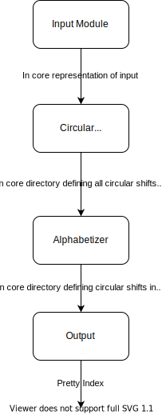

# On the criteria to be used in decomposing systems into modules

D. L. Parnas

Department of Computer Science Carnegie-Mellon University

Pittsburgh, Pa.

August, 1971

This works as supported by the Advanced Research Projects Agency of the Office of the Secretary of Defense (F44620-70-C-0107) and is monitored by the Air Force Office of Scientific Research. This document has been approved for public release and sale; its distribution is unlimited.

# Abstract 

This paper discusses modularization as a mechanism for improving the flexibility and comprehensibility of a system while allowing the shortening of its development time. The effectiveness of a "modularization" is dependent upon the criteria used in dividing the system into modules. Two system design problems are presented, and for each, both conventional and unconventional decomposition are described. It is shown that the unconventional decompositions have distinct advantages for the goals outlined. The criteria used in arriving at the decompositions are discussed. The unconventional decomposition, if implemented with the conventional assumption that a module consists of one or more subroutines, will be less efficient in most cases. An alternative approach to implementation which does not have this effect is sketched.

# Introduction

If programmers sang hymns, some of the most popular would be hymns in praise of modular programming. A lucid statement of this philosophy is to be found in a new textbook on the design of system programs which we quote below:

> "A well-defined segmentation of the project effort ensures system modularity. Each task forms a separate, distinct program module. At implementation time each module and its inputs and outputs are well-defined, there is no confusion in the intended interface with other system modules. At checkout time the integrity of the module is tested independently; there are few scheduling problems in synchronizing the completion of several tasks before checkout can begin. Finally, the system is maintained in modular fashion; system errors and deficiencies can be traced to specific system modules, thus limiting the scope of detailed error searching."[1, paragraph 10.23]*

I must begin by saying that I am in complete agreement with this statement though I might not agree with some possible interpretations. Note, however, that nothing is said about the criteria to use in dividing the system into modules. Because the decision to divide a system into n modules of a given size does not determine the decomposition, this paper will discuss that issue and, by means of examples, suggest the type of criteria that should be used in decomposing the system into modules.

# A brief status report

The major progress in the area of modular programming has been the development of coding techniques and assemblers which (1) allow one module to be written with little knowledge of the **code** used in another module and, (2) allow modules to be reassembled and replaced without reassembly of the whole system. This facility is extremely valuable for the production of large pieces of code, but its use has not resulted in the expected benefits. In fact, the system most often used as examples of the problems involved in producing large systems are themselves highly modularized programs which make use of the sophisticated coding and assembly techniques mentioned above.

# Expected benefits of modular programming

The expected benefits of modular programming fall into three classes: (1) managerial -- development time could be shortened because separate groups would work on each module with little need for communication (and little regret afterward that eree had not been more communication); (2) product flexiibility -- it was hoped that it would be possible to make quite drastic changes or improvements in one module without changing others; (3) comprehensibility -- it was hoped that the system could be studied a module at a time with the result that the whole system could be better designed because it was better understood.

# What is a "modularization"?

In the sequel I give several partial system descriptions called "modularizations". In this contexst "module" is best considered to be a work assignment unit rather than a subprogram. The modularizations are intended to describe the deisgn decisions which must be made **before** the work on independent modules can begin. Although quite different decisions are made in each alternative, in all cases the intention is to describe all "system level" decisions (i.e., decisions which affect more than one module).

# Example system 1: a KWIC index production system

For those who may not know what a KWIC index is the following description will suffice for this paper. The KWIC index system accepts an ordered set of lines, each line is an ordered set of characters. Any line may be "circularly shifted" by repeatedly removing the first word and adding it to the end of the line. The KWIC index system outputs a listing of all circular shifts of all lines in alphabetical order. This is a samll sytem. Except under extreme circumstances (huge database, no supporting software), such a system could be produced by a good programmer within a week or two. Consequently it is a poor example in the none of the reasons motivating modular programming are important for this sytem. Because it is impractical to treat a large system thoroughly, we shall go through the eexercise of treating this problem as if it were a large project. We give two modularizations. One, we fell, typifies current projects; the other has been used successfully in an undergraduate class project.

## Modularization 1

We see the following modules:

**Module 1**: **Input**: This module contains a single main program which reads the data lines from the input medium and stores them in core for processing by the remaining modules. In core the characters are packed four to a word, and an otherwise unused character is used to indicate end of a word. An index is kept to show the starting address of each line.

**Module 2**: **Circular Shift**: This module is called after the input module as completed its work. Rather than store all of the circulaar shifts in core, it prepares an index which gives the address of the first character of each circular shift, and the original index of the line in the array made up by module 1. It leaves its output in core with words in pairs (original line number, starting address).

**Module 3**: **Alphabetizing**: This module takes as input the arrays produced by modules 1 and 2. It produces an array in the same format as that produced by module 2. In this case, however, the circular shifts are listed in another order (alphabetically).

**Module 4**: **Output**: Using the arrays produced by module 3 and module 1, this module produces a nicely formatted output listing all of the circular shifts. In a sophisticated system, the actual start of each line will be marked, pointers to further information may be inserted, the start of the circular shift may actually not be the first word in the line, etc., etc.

**Module 5**: **Master Control**: This module does little more than control t he sequencing among the other four modules. It may also handle error messages, space allocation, etc.

It should be clear that the above does not constitute a definitive document. Much more information would have to be supplied before work could start. The defining documents would include a number of pictures showing core formats, pointer conventions, calling conventions, etc., etc. Only when all of the interfaces between the four modules had been specified could work really begin.

This is a modularization in the sense menat by all proponents of modular programming. The system is divided into a number of relatively independent modules with well defined interfaces; each one is small enought and simple enough to be thoroughly understood and well programmed. Experiments on a small scale indicate that this is approximately the decomposition which would be proposed by most programmers for the task specified. Figure 1 gives a picture of the structure of the system.

Figure 1

Structure of KWIC index decomposition 1



## Modularization 2

We see the following modules:

**Module 1**: **Line Storage**: This module consists of a number of functions each one of which is given a precise specification in Figure 2. By calling these functions one may add a character to the end of the last word in the last line, start a new word, or start a new line. One may call other functions to find  the kth character of the kth word in the jth line. Other routines in this module may be called to reveal the number of lines, the number of words in a line, or the number of characters in any word. A precise definition of this module is  given in Figure 2. The method of specification haas been explained in [3].

**Module 2**: **Input**: This module reads the original lines from the input media **and calls the Line Storage module to have them stored internally**.

**Module 3**: **Circular Shifter**: This module contains a number of functions. CSSTUP cause the others to have defined values. The others are intended to be analogue of  the information giving functions in module 1. Using them one may refer to the kth character of jth word of  the ith circular shift, as well as getting the lengths of lines and words, etc. This is shown in Figure 3.

**Module 4**: **Alphabetizer**: This module consists principally of two functions. One, ALPH, must be called before the others will have a defined value. The second, ITH, will serve as an index. ITH(i) will give the index of the circular shift which comes ith in the alphabetical ordering. Formal definitions of these functions are given in Figure 4.

**Module 5**: **Output**: This module will give the desired printing of any circular shift. It calls upon Circular Shift functions.

**Module 6**: **Master Control**: Similar in function to the modularization above.

Figure 2

Definition of a "Line Storage" Module

**Introduction**: This definition specifies a mechanism which may be used to hold up to p1 line, each line consisting of up to p2 words, and each word may be up to p3 characters.

```
Function WORD
  Possible values: integers
  initial values: undefined
  parameters: l,w,c all integer
  effect:
    call ERLWEL* if 1 < 1 or 1 > p1
    call ERLWNL if 1 > LINES
    call ERLWEW if w < 1 or w > p2
    call ERLWNW if w > WORDS(1)
    call ERLWEC if c < 1 or c > p3
    call ERLWNC if c > CHARS(1, w)
    
---
* The routine named are to be written by the user of the module. The call
informs the user that he has violated a restriction on the module; the sub-
routine should contain his recovery instructions [3].
```

```
Function SETWRD
  possible values: none
  initial values: not applicable
  parameters: l,w,c,d all integers
  effect:
    call ERLSLE if l < 1 or l > p1
    call ERLSBL if l > 'LINES' + 1
    call ERLSBL if 1 < 'LINES'
    call ERLSWE if w < 1 or w > p2
    call ERLSBW if w > 'WORDS'(1) + 1
    call ERLSBW if w < 'WORDS'(1)
    call ERLSCE if c < 1 or c > p3
    if l = 'LINES' + 1 then LINES = 'LINES' + 1
    if w = 'WORD'(1) + 1 then WORDS(1) = w
    CHARS(1,w) = c
    WORD(1,w,c) = d
```

# Comparison of the Two Modularizations 

Both schemes will work. The first is quite conventional; the second has been used successfully in a class project [7]. Both will reduce the programming to the relatively independent programming of a number of small, manageable, programs. We must, however, look more deeply in order to investigate the progress we have made towards the stated goals. 

I must emphasize the fact that in the two decompositions I **may not** have changed any representations or methods. It is my intention to talk about two different ways of cutting up what **may** be the same object. A system built according to decomposition 1 could conceivably be identical after assembly to one built according to decomposition 2. The differences between the two systems are in the way that they are divided into modules, the definitions of those modules, the work assignments, the interfaces, etc. The algorithms used in both cases **might** be identical. I claim that the systems are substantially different even if identical in the runnable representation. This is possible becuase the runnable representation is used only for running; other representations are used for changing, documenting, understanding, etc. In those other representations the two systems will not be identical. 

## (1) Changeability. 

There are a number of design decisions which are questionable and likely to change under many circumstances. A partial list: 

1. Input format. 
1. The decision to have all lines stored in core. For large indices it may prove inconvenient or impractical to keep all of the lines in core at any one time. 
1. The decision to pack the characters four to a word. In cases where we are working with small indices it may prove undesirable to pack the characters, time will be saved by a
character per word layout. In other cases, we may pack, but in different formats. 
1. The decision to make an index for the circular shifts rather than actually store them as such. Again, for a small index or a large core^writing them out may be the preferable
approach. 
1. The decision to alphabetize the list once, rather than search for each item when needed, or partially alphabetize as is done in Hoare's FIND [2]. In a number of circumstances it would be advantageous to distribute the computation involved in alphabetization over the time required to produce the index. 

It is by looking at changes such as these that we can see the differences between the two modularizations. The first change is, in both decompositions, confined to one module, but the second change would result in changes in every module for the first decomposition. The same is true of the third change. In the first decomposition the format of
the line storage in core must be used by all of the programs. In the second decomposition the story is entirely different. Knowledge of the exact way that the lines are stored is entirely hidden from all but module 1. Any change in the manner of storage can be confined to that module! 

In fact, in some of the versions of this system there was an additional module in the decomposition. A symbol table module as described in [3] was used within the line storage module. This fact, where true, was completely invisible to the rest of the system. 

The fourth change is confined to the circular shift module in the second decomposition but in the first decomposition, the alphabetizer, and the output routines will also know of the change. 

The fifth change will also prove difficult in the first decomposition. The output module will expect the index to have been completed before it began. The alphabetizer module in the second decomposition was designed so that a user could not detect when the alphabetization was actually done. No other module need be changed. 

## (2) Independent development. 

In the first modularization the interfaces between the modules are the fairly complex formats and table organizations described above. These represent design decisions which
cannot be taken lightly. The table structure and organisation are essential to the efficiency of the various modules and must be designed carefully. The development of those formats will be a major part of the module development and that part must be a joint effort among the several development groups. In the second modularization the interfaces
are more abstract, they consist primarily in the function names and the numbers and types of the parameters. These are relatively simple decisions and the independent development of modules should begin much earlier. 

## (3) Comprehensibility. 

To understand the output module in the first modularization, it will be necessary to understand something of the alphabetizer, the circular shifter and the input module. There will be aspects of the tables used by output which will only make sense because of the way that the other modules work. There will be constraints on the structure of the tables due to the algorithms used in the other modules. The system will only be comprehensible as a whole. It is my subjective judgment that this is not true in the second modularization

# The Criteria 

Many readers will now see what criteria were used in each decomposition. In the first decomposition the criterion used was make each 'major step' in the processing a module. One might say that to get the first decomposition one makes a flowchart. Figure 1 is a flowchart. This is the most common approach to decomposition or modularization. It is an outgrowth of all programmer training which teaches us that we should begin with a rough flowchart and move from there to a detailed implementation. The flowchart was a useful abstraction for systems with on the order of 5,000-10,000 instructions, but as we move beyond that it does not appear to be sufficient; something additional is needed. 

The second decomposition was made using "information hiding" [4] as a criteria. The modules no longer correspond to steps in the processing. The line storage module, for example, is used in almost every action by the system. Alphabetization may or may not correspond to a phase in the processing according to the method used. Similarly, circular shift might, in some circumstances, not make any table at all but calculate each character as demanded. Every module in the second decomposition is characterized by its knowledge of a design decision which it hides from all others. Its interface or definition was chosen to reveal as little as possible about its inner workings. 

# Improvement in Circular Shift Module 

To illustrate the impact of such a criterion let us take a closer look at the definition of the circular shifter module from the second decomposition. Hindsight now suggests that this definition reveals more information than necessary. While we have carefully hidden the method of storing or calculating the list of circular shifts, we have indicated an order to that list. Programs could be effectively written if we specified only (1) that the 'lines1 indicated in circular shift's definition will all exist in the "table", (2) that no one of them would be included twice and (3) that a function existed which would allow us to identify the original line given the "shift". By prescribing the order for the shifts we have given more information than necessary and so unnecessarily restricted the class of systems that we can build without changing the definitions. For example, we have not allowed for a system in which the circular shifts were "produced" in alphabetical order, alph is empty, and ITH simply returns its argument as a value. Our failure to do this in constructing the systems with the second decomposition must clearly be classified as a design error. 

# Efficiency and Implementation 

If we are not careful the second decomposition will prove to be much less efficient. If each of the "functions" is actually implemented as a procedure with an elaborate calling sequence there will be a great deal of such calling due to the repeated switching between modules. The first decomposition will not suffer from this problem because there is relatively infrequent transfer of control between modules. 

To save the procedure call overhead yet gain the advantages that we have seen above we must implement these modules in an unusual way. In many cases the routines will be best inserted into the code by an assembler; in other cases, highly specialized and efficient transfers would be inserted. To successfully and efficiently make use of the second type of decomposition will require a tool by means of which programs may be written as if the functions were subroutines but assembled by whatever implementation is appropriate. If such a technique is used, the separation between modules may not be clear in the final code. For that reason additional, program modification, features would also be useful. In other words, the other representations of the program (which were mentioned earlier) must be maintained in the machine together with a machine supported mapping between them.

# A SECOND EXAMPLE: A MARKOV ALGORITHM TRANSLATOR 

Although the first example makes most of the points of this paper it will be useful to look briefly at a somewhat different example. This one is a translator intended to execute Markov Algorithms. Markov Algorithms have been described in numerous places; the description of them as a programming language is best found in Galler and Perils [6]. For those who are not familiar with them, Markov Algorithms might be described as a poor man's SNOBOL. The only memory in the machine is a character string (always expandable if needed). The algorithm is described by a set of rules. Each rule consists of a pattern to be matched and a substitution part specifying a string to be used to replace the matched wtring. The sequencing rule is that the first rule which can be applied (its pattern matches) is applied at the leftmost part of the register where it will match. When the substitution is complete, the first applicable rule again applies (i.e., there is no memory of the last rule to be applied or the last change made). 

# Conventional Modularizations 

There are two conventional modularizations of this type of translator, They are: 

## 1. Interpretor 

**Input module**: Reads the input, parsing it into rules and storing a direct representation of the rule in core. 

**Interpretor**: Attempts to apply each rule to the register. It accesses the data structure storing the rules, uses the pattern to look for a match, and if a match is found, then uses the substitution to change the register. 

There may also be an output module doing appropriate printing. 

## 2. Compiler: 

**Input module**: Reads the input, parses it, and passes a representation of each syntactic unit as a parameter to the next module, encoder. 

**Encoder**: This consists of routines which are passed a rule or part of a rule and produce machine code which would enact it, e.g., they produce a machine code program for each pattern which searches for the occurrence of that pattern. This is known as the compiled code. 

**Run Time Routines**: Consist of a standard set of machine code routines used in every algorithm. The compiled routines link to these routines for such functions as output, etc. 

# An Alternative Approach 

We have used successfully the following modularization: 

**Rule Storage**: Stores a representation of the rules in core. This module is in many ways analagous to the Line Storage Module. 

**Rule Interpretation**: Knows the meaning of a rule, e.g., knows how to examine the stored rule and apply any given rule. 

**Register Manipulation**: Consists of a set of routines which make all manipulations on the register. 

**Sequencing**: Chooses the next rule to be applied.

**Input**: Reads the input and calls rule storage and register manipulation modules for the purpose of internal storage. 

**Output**: Does necessary printing of register, last rule to apply, etc. 

# Discussion of Second Example

Many of the arguments from the first example could be repeated here. For example, the separation of register manipulation from the other modules allows easier changing of the register representation. The separation of rule sequencing from rule interpretation allows one to experiment easily with some of the other forms of Markov Algorithms described in [6]. 

We have chosen this example to make another point, however. This modularization has not made a decision between interpretor and compiler. We can switch between an interpretive translator and a compiler relatively easily and we can also choose many points on a spectrum between the two. Register manipulation, sequencing, input and output will remain (or may remain) with little changes. The major change is in the rule interpretation module, which in the compiler stores a machine code program once, but in the interpretor applies the rule when called to interpret. There can be a great deal of code in common between the two systems. For example, the register manipulation code is used in both versions. In the computer it is part of the run time routines; in the interpretor it is called by the rule interpretation module. 

# HIERARCHICAL STRUCTURE 

We can find a program hierarchy in the sense illustrated by Dijkstra [5] in the system defined according to decomposition 2. If a symbol table exists, it functions without any of the other modules, hence it is on level 1. Line storage is on level 1 if no symbol table is used or on level 2 otherwise. Input and Circular Shifter require line storage for their functioning. Output and Alphabetizer will require Circular Shifter, but since circular shifter and line holder are in some sense compatible it would be easy to build a parameterized version of those routines which could be used to alphabetize or print out either the original lines or the circular shifts. In the first usage they would not require circular shifter; in the second they would. In other words, our design has allowed us to have a single representation for programs which may run at either of two levels in the hierarchy. 

In discussions of system structure it is easy to confuse the benefits of a good decomposition with the benefits of a hierarchical structure. We have a hierarchical structure if a certain relation may be defined between the modules or programs and that relation is a partial ordering. The relation we are concerned with is "uses11 or "depends upon".  It is better to have a relation between programs since in many cases one module depends upon only part of another module (e.g.,  Circular Shifter depends only on the output parts of the line holder and not on the correct working of SETWORD). It is conceivable that we could obtain the benefits that we have been discussing without such a partial ordering, e.g., if all the modules were on the same level. The partial ordering gives us two additional benefits. First, parts of the system are benefited by (simplified) because they use the services of lower levels. Second, we are able to cut off the upper levels and still have a usable and useful product. For example, the symbol table can be used in other applications, the line holder could be the basis of a question answering system. The existence of the hierarchical structure assures us that we can "prune" off the upper levels of the tree and start a new tree on the old trunk. If we had designed a system in which the "low level" modules made some use of the "high level" modules we would not have the hierarchy, we would infd it much harder to remove portions of the system,and "level" would not have much meaning in the system. 

Since it is conceivable that we could have a system with the type of decomposition described shown in version 1 (important design decisions in the interfaces) but retain a hierarchical structure, we must conclude that hierarchical structure and "clean" decomposition are two desirable but independent properties of a system structure. 

# CONCLUSION

We have tried to demonstrate by these examples that it is almost always incorrect to begin the decomposition of a system into modules on the basis of a flowchart. We propose instead that one begins with a list of difficult design decisions or design decisions which are likely to change. Each module is then designed to hide such a decision from the others. Since, in most cases, design decisions transcend time of execution, modules will not correspond to steps in the processing. To achieve an efficient implementation we must abandon the assumption that a module is one or more subroutines, and instead allow subroutines and programs to be assembled collections of code from various modules. 

# References

1. Gauthier, Richard and Stephen Ponto, Designing Systems Programs, (C) 1970, Prentice-Hall, Inc.
2. Hoare, C. A. R., "Proof of a Program, FIND,11 Comm. ACM. January 1971.
3. Parnas, D. L., A Paradigm for Software Module Specification with Examples, Technical Report, Department of Computer Science, Carnegie Mellon University, Pittsburgh, Pa., 1971.
4. Parnas, D. L., Information Distribution Aspects of Design Methodology, Technical Report, Department of Computer Science, Carnegie-Mellon University, Pittsburgh, Pa., 1971. Also to be presented at the IFIP Congress 1971, Ljubeljana, Yugoslavia.
5. Dijkstra, E. W., "The T.H.E. Multiprogramming System," CACM, May 1967.
6. Galler, B. and A. J. Perils, A View of Programming Languages, Addison Wesley, 1970.
7. Parnas, D. L., A Course on Software Engineering, in preparation. 


